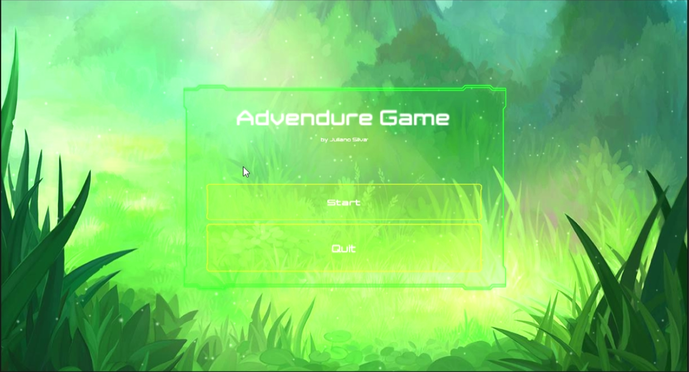
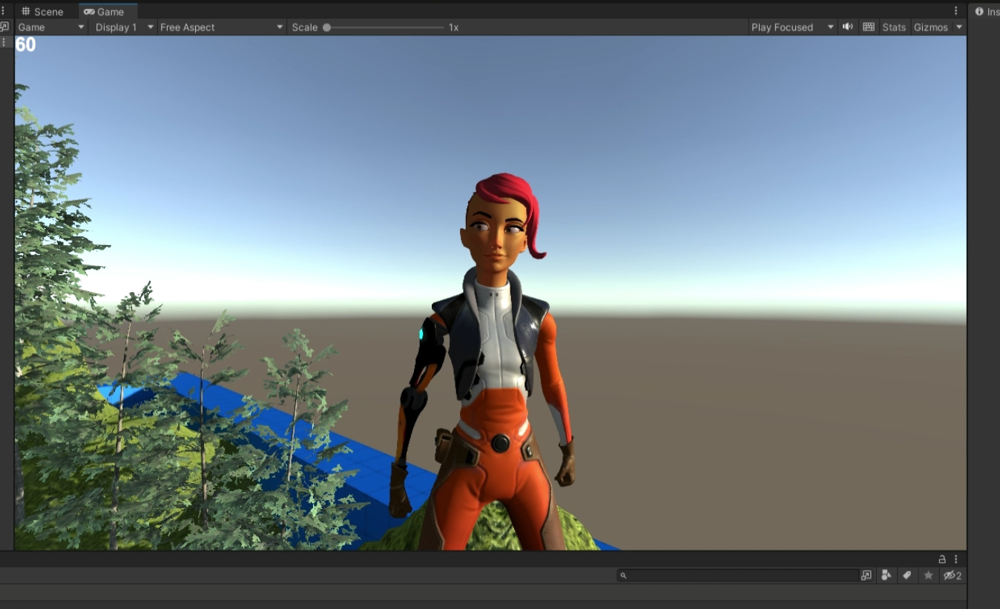
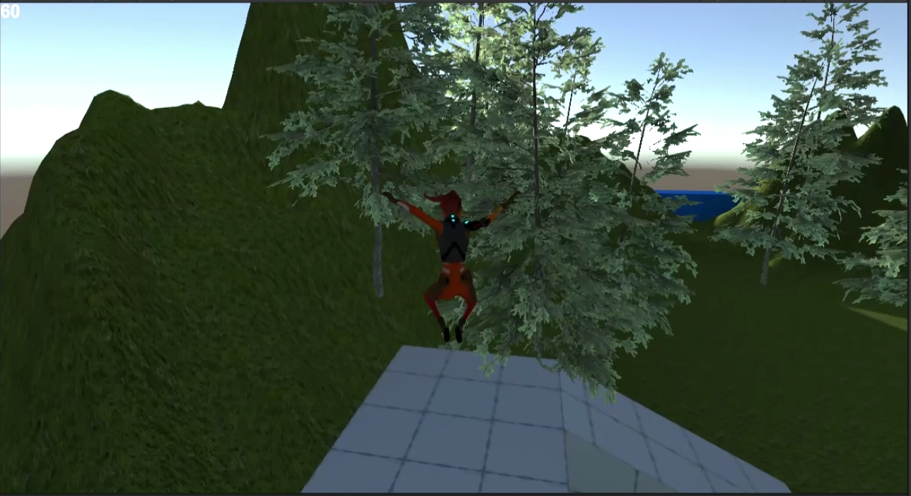
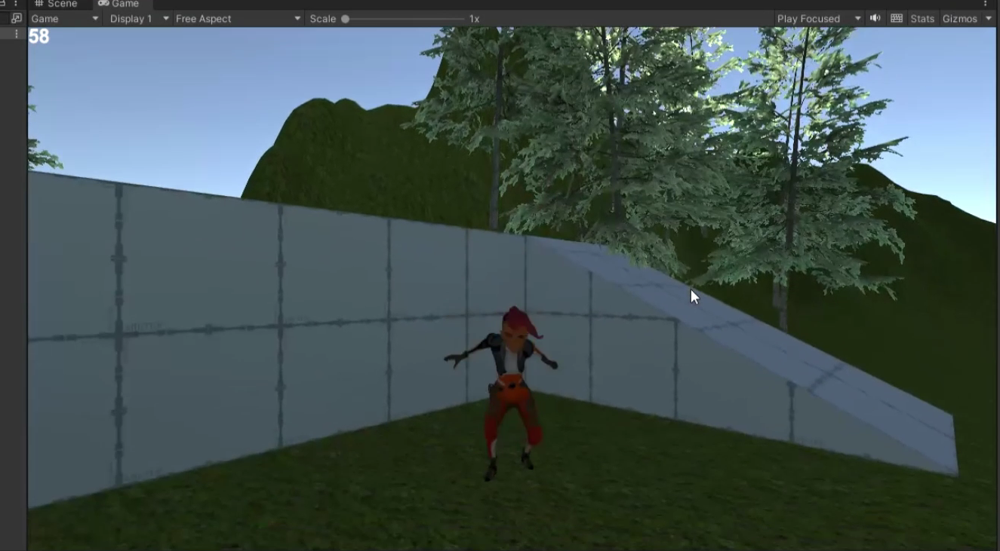

## Adventure Game

**Descrição:**

Adventure Game é um emocionante jogo de aventura onde os jogadores podem explorar um vasto cenário interativo. Com controles intuitivos e gráficos imersivos, os jogadores podem mover-se livremente, interagir com diversos objetos e enfrentar desafios únicos.

**Instruções para Jogabilidade:**

- **Movimentação:** Use as teclas W, A, S, D para movimentar o personagem.
- **Pular:** Pressione a tecla Espaço para pular.
- **Controle da Câmera:** Use o mouse para controlar a câmera.
- **Interação com Objetos:** Aproximar-se de objetos interativos, como subir em cima deles, pular sobre eles, desviar de árvores, alcançar plataformas.

---

**Gameplay:**

Confira um vídeo de gameplay do nosso jogo:

- **Link:** https://youtu.be/C9tVizUplns

---

**Prints de Tela:**

**Menu Principal:**



**Exploração do Cenário:**



**Interação com Objetos:**



**Animação de Pouso:**



---

**Funcionalidades Desenvolvidas:**

1. **Interação com o Cenário:**
   Foi desenvolvido um sistema de interação que permite ao jogador subir em objetos, cair e ter o movimento de pouso. Isso aumenta a imersividade e realismo do jogo.

   **Código da Interação com Objetos:**
   ```csharp
   private void UpdateGrounded()
   {
       _justWalkedOffALedge = false;

       bool isGrounded = CheckGrounded();
       if (IsGrounded && !isGrounded && !_jumpInput)
       {
           _justWalkedOffALedge = true;
       }

       IsGrounded = isGrounded;
   }

   private bool CheckGrounded()
   {
       Vector3 spherePosition = transform.position;
       spherePosition.y = transform.position.y + GroundSettings.SphereCastRadius - GroundSettings.SphereCastDistance;
       bool isGrounded = Physics.CheckSphere(spherePosition, GroundSettings.SphereCastRadius, GroundSettings.GroundLayers, QueryTriggerInteraction.Ignore);

       return isGrounded;
   }

   private void Tick(float deltaTime)
   {
       UpdateHorizontalSpeed(deltaTime);
       UpdateVerticalSpeed(deltaTime);

       Vector3 movement = _horizontalSpeed * GetMovementInput() + _verticalSpeed * Vector3.up;
       _characterController.Move(movement * deltaTime);

       OrientToTargetRotation(movement.SetY(0.0f), deltaTime);

       UpdateGrounded();

       _characterAnimator.UpdateState();
   }
   ```

   **Print da Interação:**

   

2. **Movimento de Pouso:**
   O movimento de pouso foi implementado para aumentar o realismo do jogo. Quando o personagem cai de uma certa altura, ele realiza um movimento de pouso antes de retomar a jogabilidade normal.

   **Código do Movimento de Pouso:**
   ```csharp
   private void UpdateVerticalSpeed(float deltaTime)
   {
       if (IsGrounded)
       {
           _verticalSpeed = -GravitySettings.GroundedGravity;

           if (_jumpInput)
           {
               _verticalSpeed = MovementSettings.JumpSpeed;
           }
       }
       else
       {
           if (!_jumpInput && _verticalSpeed > 0.0f)
           {
               // This is what causes holding jump to jump higher than tapping jump.
               _verticalSpeed = Mathf.MoveTowards(_verticalSpeed, -GravitySettings.MaxFallSpeed, MovementSettings.JumpAbortSpeed * deltaTime);
           }
           else if (_justWalkedOffALedge)
           {
               _verticalSpeed = 0.0f;
           }

           _verticalSpeed = Mathf.MoveTowards(_verticalSpeed, -GravitySettings.MaxFallSpeed, GravitySettings.Gravity * deltaTime);
       }
   }
   ```

   **Print do Movimento de Pouso:**
    
   